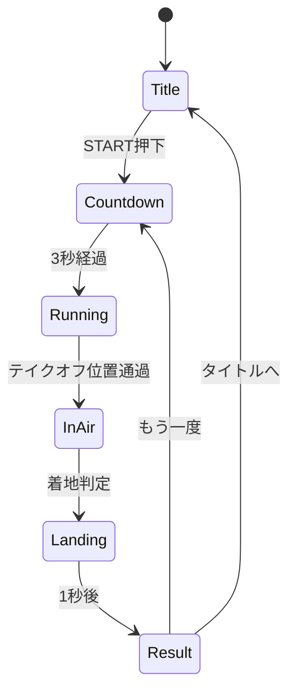

# Unity スキージャンプ シーン・UI設計

## シーン構成

```
Scenes/
├── TitleScene.unity        # タイトル + 接続テスト
├── SkiJumpScene.unity      # メインゲーム
└── (シーン間遷移は SceneManager)
```

---

## Phase 1: タイトルシーン (TitleScene)

### 画面構成

```
┌─────────────────────────────────────────────┐
│                                             │
│            ⛷️ THE GROUND                    │
│         Ski Jump Experience                 │
│                                             │
│    ┌─────────────────────────────────┐      │
│    │  接続状態                        │      │
│    │  PC: ● Connected (192.168.1.10) │      │
│    │  Balance Board: ● Ready         │      │
│    │  Calibration: ○ Not Done        │      │
│    └─────────────────────────────────┘      │
│                                             │
│         [ Calibrate ]  [ Test Vib ]         │
│                                             │
│              [ START JUMP ]                 │
│           (キャリブ完了後有効)               │
│                                             │
└─────────────────────────────────────────────┘
```

### 機能要件

| ID | 機能 | 説明 |
|----|------|------|
| T-01 | 接続状態表示 | PC/Board/Calibrationのステータス |
| T-02 | Calibrateボタン | キャリブ開始、3秒カウントダウン表示 |
| T-03 | Test Vibボタン | 振動テスト (2秒間Snow波形) |
| T-04 | STARTボタン | キャリブ完了時のみ有効化 |
| T-05 | 自動接続 | シーン開始時にUDP受信開始 |

### UIコンポーネント

```csharp
public class TitleUIController : MonoBehaviour
{
    [SerializeField] TMP_Text _connectionStatus;
    [SerializeField] Button _btnCalibrate;
    [SerializeField] Button _btnTestVib;
    [SerializeField] Button _btnStart;
    
    void UpdateConnectionStatus();
    void OnCalibrateClicked();
    void OnTestVibClicked();
    void OnStartClicked();  // → SkiJumpScene
}
```

---

## Phase 2: ゲームシーン (SkiJumpScene)

### サブフェーズ

```
[Countdown] → [Running] → [InAir] → [Landing] → [Result]
    3秒        ~10秒       ~3秒      一瞬        5秒
```

### 2A: Countdown (3秒)

```
┌─────────────────────────────────────────────┐
│                                             │
│                   3                         │
│               (大きく表示)                   │
│                                             │
│         姿勢を前傾にして準備してください       │
│                                             │
└─────────────────────────────────────────────┘
```

| 要件 | 説明 |
|------|------|
| カウントダウン表示 | 3, 2, 1, GO! |
| 振動なし | まだ滑走開始前 |
| 姿勢ガイド | 「前傾で準備」テキスト |

### 2B: Running (滑走フェーズ, ~10秒)

```
┌─────────────────────────────────────────────┐
│  Speed: 72 km/h                    ⛷️       │
│  ████████████░░░░░░ 80%                     │
│                                             │
│              [3D シーン]                    │
│           スキージャンプ台を滑走             │
│                                             │
│                                             │
│         ▲ 前傾で加速 / ▼ 後傾で減速          │
└─────────────────────────────────────────────┘
```

| 要件 | 説明 |
|------|------|
| 速度表示 | km/h + プログレスバー |
| 振動 | SnowTexture (速度連動) |
| 姿勢ガイド | 前傾/後傾のヒント |
| カメラ | 一人称視点、速度でFOV変化 |

### 2C: InAir (飛行フェーズ, ~3秒)

```
┌─────────────────────────────────────────────┐
│                                             │
│              Takeoff: 85 km/h               │
│                                             │
│              [3D シーン]                    │
│             空中を飛んでいる                 │
│                                             │
│              距離: 87.5 m                   │
│                                             │
└─────────────────────────────────────────────┘
```

| 要件 | 説明 |
|------|------|
| 振動 | **OFF** (静寂で浮遊感) |
| 距離表示 | リアルタイム更新 |
| 姿勢影響 | 前傾で飛距離↑、後傾で↓ |

### 2D: Landing (着地)

| 要件 | 説明 |
|------|------|
| 振動 | **Pulse** (0.2秒, 高振幅) |
| 視覚効果 | 画面揺れ + パーティクル |
| 即座に結果へ | 1秒後にResult表示 |

### 2E: Result (結果表示, 5秒)

```
┌─────────────────────────────────────────────┐
│                                             │
│              🏆 RESULT                      │
│                                             │
│            飛距離: 92.5 m                   │
│            最高速度: 88 km/h                │
│                                             │
│            評価: ★★★☆☆ (3/5)              │
│                                             │
│    [ もう一度 ]         [ タイトルへ ]       │
│                                             │
└─────────────────────────────────────────────┘
```

| 要件 | 説明 |
|------|------|
| 飛距離 | メイン表示 |
| 最高速度 | サブ表示 |
| 評価 | K点(90m)基準で星評価 |
| ボタン | リトライ or タイトル戻り |

---

## Unity プロジェクト構成

```
Assets/
├── Scenes/
│   ├── TitleScene.unity
│   └── SkiJumpScene.unity
│
├── Scripts/
│   ├── Core/
│   │   ├── TheGroundManager.cs      # 通信
│   │   └── GameManager.cs           # シーン遷移
│   │
│   ├── Game/
│   │   ├── SkiJumpController.cs     # ゲームロジック
│   │   ├── PlayerController.cs      # プレイヤー移動
│   │   └── PhysicsSimulator.cs      # 物理
│   │
│   └── UI/
│       ├── TitleUIController.cs
│       ├── GameUIController.cs
│       └── ResultUIController.cs
│
├── Prefabs/
│   ├── JumpHill.prefab              # ジャンプ台
│   ├── Skier.prefab                 # スキーヤー
│   └── SnowParticle.prefab          # 雪エフェクト
│
└── Materials/
    ├── Snow.mat
    └── Sky.mat
```

---

## フェーズ遷移図



---

## 実装優先順位

| 優先度 | 項目 | 工数 |
|--------|------|------|
| 1 | TitleScene (接続テスト) | 2h |
| 2 | SkiJumpController (ステートマシン) | 3h |
| 3 | Running フェーズ (振動連動) | 2h |
| 4 | InAir + Landing | 1h |
| 5 | Result + 遷移 | 1h |
| 6 | 3Dモデル・エフェクト | 2h |

**合計**: 約11時間
